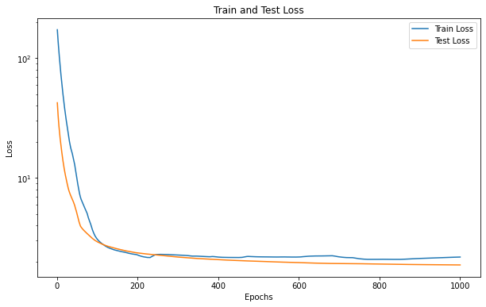

# ML Regression Models from Scratch

This repository contains the solutions to the second practical assignment for the course "I302 - Machine Learning and Deep Learning" for the second semester of 2023.

## Table of Contents

- [Introduction](#introduction)
- [Problem Descriptions](#problem-descriptions)
  - [1. Polynomial Regression](#1-polynomial-regression)
  - [2. Ridge Linear Regression](#2-ridge-linear-regression)
  - [3. Fully Connected Neural Network](#3-fully-connected-neural-network)
- [Results](#results)
  - [Polynomial Regression Results](#polynomial-regression-results)
  - [Ridge Linear Regression Results](#ridge-linear-regression-results)
  - [Fully Connected Neural Network Results](#fully-connected-neural-network-results)

## Introduction

This repository contains a collection of Jupyter Notebooks and Python scripts developed for the second practical assignment of the "I302 - Machine Learning and Deep Learning" course. The assignment involves solving three different machine learning problems using only basic tools such as NumPy, Pandas, Matplotlib, and Tqdm. There is no use of high-level libraries such as TensorFlow, PyTorch, or Scikit-learn

## Problem Descriptions

### 1. Polynomial Regression

The goal is to fit a polynomial regression model to a dataset provided in the `toy dataset.pkl` file. The tasks include:

- Deriving the equations for the optimal parameters using the maximum likelihood principle.
- Training models with various polynomial degrees and selecting the best model based on validation error.
- Implementing regularization to prevent overfitting and selecting the best regularization parameter.

### 2. Ridge Linear Regression

In this problem, we work with the `Student Performance DEV.csv` dataset to develop a linear regression model with L2 regularization (Ridge Regression). The tasks include:

- Implementing the Ridge Regression model and analyzing the impact of different features.
- Tuning the regularization parameter using cross-validation.
- Evaluating the model's performance using metrics such as RMSE, MAE, and R².

### 3. Fully Connected Neural Network

Using the same dataset from problem 2, this problem involves implementing a fully connected neural network. The tasks include:

- Implementing the neural network from scratch, allowing for different depths and widths.
- Using gradient descent and backpropagation for optimization.
- Applying cross-validation to select the best hyperparameters, and comparing the performance against the Ridge Regression model.

## Results

### Polynomial Regression Results

### Ridge Linear Regression Results

### Fully Connected Neural Network Results

### Contributions

This practical assignment was developed by Máximo Gubitosi as part of the “I302 - Machine Learning and Deep Learning” course during the second semester of 2023.
